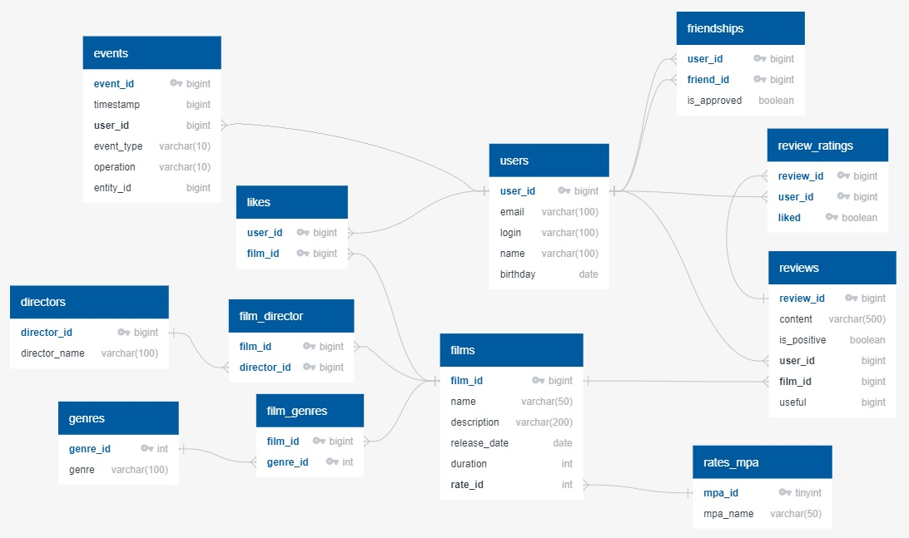

# Filmorate (учебный проект с этапа командной работы)
## Стэк:
Spring Boot, JDBC, H2, Maven, Lombok.
## Функциональность:
Бэкенд для сервиса, который работает с фильмами и оценками пользователей.
## Запуск:
- Проект запускается из среды разработки Intellij IDEA 2022;
- Основной класс - FilmorateApplication.

## В ветке develop реализован следующий функционал:
 - Отзывы о фильмах;
 - Поиск;
 - Общие фильмы (с другими пользователями);
 - Рекомендации;
 - Лента событий;
 - Популярные фильмы;
 - Фильмы по режиссёрам;
 - Удаление фильмов и пользователей.

## ER-диаграмма

